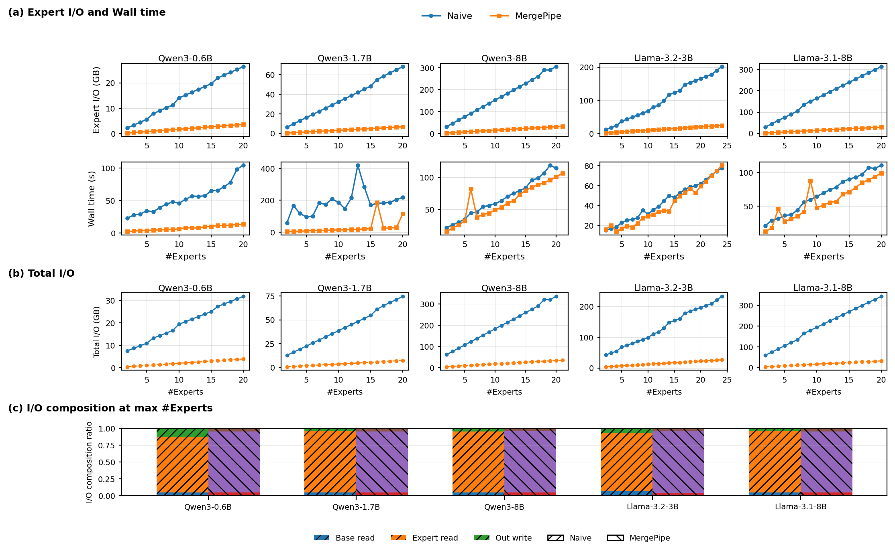
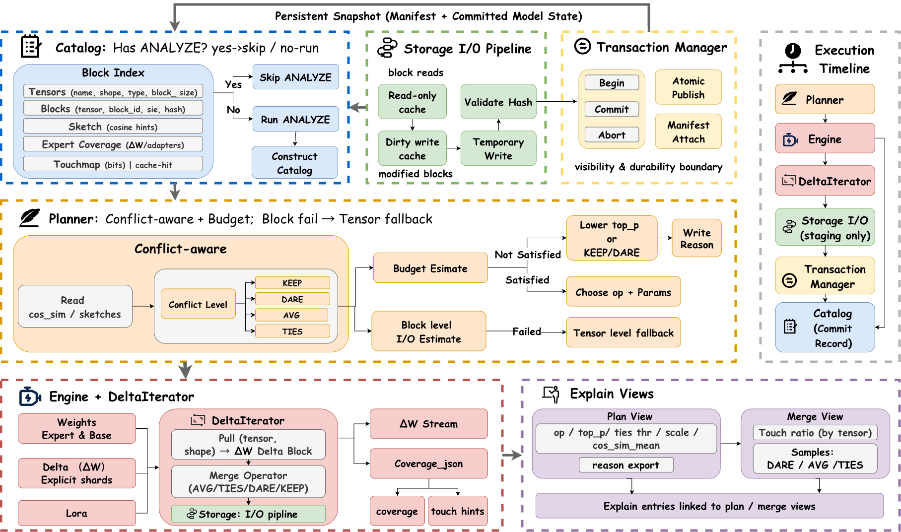

<p align="center">
  
</p>

<h1 align="center">MergePipe</h1>

<p align="center">
  <b>Budget-Aware Parameter Management System for Scalable LLM Merging</b>
</p>

<p align="center">
  <i>A parameter management system that makes large-scale LLM merging predictable, reproducible, and scalable.</i>
</p>


## 🔍 What is MergePipe?

**MergePipe** is the **first parameter management and execution system** for **large-scale LLM merging**.

It reframes LLM merging as a **data management problem**, rather than a one-off script execution:
> *model parameters are data, merge plans are executable objects, and merged models are committed snapshots with lineage.*

MergePipe is the **first system** to:
- explicitly model **expert parameter reads** as a **budgeted resource**,
- explicitly planning merges **before execution**, and
- materialize merged checkpoints with **atomic publish and immutable manifests**.

This project is also the code of paper "**MergePipe: A Budget-Aware Parameter Management System for Scalable LLM Merging**"

> MergePipe cuts expert I/O by up to an order of magnitude and delivers up to 11× speedups, while preserving merge correctness and quality.

## ⚡ Why MergePipe?

Modern LLM pipelines increasingly rely on *merging* dozens of expert checkpoints  
(e.g., math, code, biomedical, domain-specific experts).

However, **existing merging pipelines are system-agnostic**:

- Parameters are treated as **opaque flat files**
- Each merge **re-scans all experts**
- No reuse, no cost model, no lineage
- Expert I/O grows as **O(K)** with the number of experts

👉 In practice, **expert reads dominate merge cost**, not computation.

MergePipe addresses this **system-level bottleneck**, without changing any merge algorithm.


## 💡 Core Insight

> **Base reads and output writes are unavoidable.  
> Expert reads are not.**

MergePipe isolates the *only controllable term* in the merge cost:
- **Expert parameter I/O**

and turns it into a **first-class, user-controlled budget knob**.


## 🧠 Design Philosophy

MergePipe is built around a simple but powerful execution loop:

```

Plan  →  Execute  →  Manifest

````

### 1️⃣ Plan (Budget-Aware)
- Analyze parameter blocks using persistent metadata
- Select *which expert blocks to read* under a user-specified I/O budget
- Output a reusable **Plan Digest (π)**

### 2️⃣ Execute (Budget-Enforced)
- Stream parameters block-by-block
- Read **only selected expert blocks**
- Apply standard merge operators (AVG / TIES / DARE / …)
- Atomically materialize a new snapshot

### 3️⃣ Manifest (Lineage & Reproducibility)
- Record exactly:
  - which blocks were touched
  - which experts contributed
  - estimated vs. realized cost
- Publish an immutable **Merge Manifest**

This separation makes merges:
- predictable
- auditable
- reproducible
- reusable across iterations


## 🧩 Key Contributions

### 🔹 Budget-Aware Planning
Merge plans explicitly bind **expert I/O cost** to executable plans:
- no hidden scans
- no surprise costs
- no O(K) blowups

### 🔹 Block-Granular Execution
Parameters are managed at **tensor-block granularity**, enabling:
- fine-grained reuse
- precise cost estimation
- graceful fallback to tensor-level when needed

### 🔹 Transactional Snapshots
Every merge produces:
- a **committed snapshot ID**
- an immutable **manifest**
- atomic visibility (all-or-nothing)

### 🔹 Operator-Agnostic
MergePipe does **not** change merge semantics:
- supports AVG, TIES, DARE, adapters, deltas
- works across Llama / Qwen families
- benefits are independent of merge algorithm

---

## 📊 What Do You Get in Practice?

Empirically (see paper experiments):

- 🔻 **Up to 10× reduction in total I/O**
- 🚀 **Up to 11× end-to-end speedup**
- 📈 Stable scaling as experts increase
- 🔁 Deterministic, repeatable merges
- 🧾 Full explainability via manifests

## 📊 Experimental Results

### Expert I/O, Wall Time, and Scaling Behavior

The following figure compares MergePipe with a naive merge pipeline
across multiple model families and expert counts.



**Key observations:**
- Naive merging exhibits linear growth in expert I/O and wall time.
- MergePipe keeps expert I/O nearly flat under a fixed budget.
- Speedups grow with model size and number of experts.


### System Architecture

For a detailed end-to-end architecture of MergePipe,
including Catalog, Planner, Engine, Transaction Manager,
and Explain Views, see the full system overview:

📄 

The architecture illustrates:
- block-level catalog construction
- conflict-aware, budget-constrained planning
- ΔW streaming execution
- atomic snapshot publication
- explainability hooks linked to plans and merges


## 🏭 Industrial Use Case: Continuous Expert Integration

### Scenario
A large organization maintains multiple domain-specific LLM experts:
- general instruction model
- code expert
- math expert
- reasoning expert
- domain adapters (finance, biomedical, etc.)

New experts or updated checkpoints arrive **daily or weekly**.
The organization needs to continuously merge them into deployable models.

### Challenges Without MergePipe
- Every merge scans *all* experts (O(K) expert reads)
- Merge cost grows linearly with expert count
- No cost predictability → unstable pipelines
- No explainability → hard to debug regressions
- No lineage → merges are not auditable

### MergePipe in Production
MergePipe turns merging into a **budgeted, repeatable pipeline**:

1. **Planning**
   - Each merge request specifies an expert I/O budget (e.g., 8GB)
   - Planner selects only high-impact parameter blocks
   - Plan digest π is generated and stored

2. **Execution**
   - Engine streams only selected blocks
   - Merge operators (TIES / DARE / AVG) are applied unchanged
   - Snapshot is materialized atomically

3. **Auditing**
   - Manifest records touched blocks, experts, and realized cost
   - Regressions can be traced to specific experts or tensors

### Practical Benefits
- 🔻 Order-of-magnitude reduction in expert I/O
- 🚀 Faster iteration on expert integration
- 📊 Predictable wall-time under shared cluster resources
- 🧾 Full audit trail for compliance and debugging

MergePipe enables **continuous expert integration** without turning
model merging into a scalability bottleneck.


## 🚀 Quick Start

This guide walks you through a full end-to-end run:
**(1) create & initialize `mergedb.sqlite` → (2) register models → (3) analyze/index blocks → (4) merge → (5) verify outputs**.

### Prerequisites

- Python 3.10+
- `torch`, `safetensors`, `transformers`
- Local checkpoints in **Hugging Face safetensors** format (possibly sharded)

> Tip: MergePipe expects the **base** and **experts** to share the same parameter layout.


### Installation + Initialize DB
```bash
git clone https://github.com/your-org/mergepipe
cd mergepipe
python -m pip install -e .
mergepipe init-db --db /tmp/mergepipe.sqlite
````

### Rigster base and experts (only once)

```bash
mergepipe register --db /tmp/mergepipe.sqlite --model-id base_qwen06b --uri /path/to/base --arch unknown --dtype unknown
mergepipe register --db /tmp/mergepipe.sqlite --model-id exp1 --uri /path/to/expert1 --arch unknown --dtype unknown
mergepipe register --db /tmp/mergepipe.sqlite --model-id exp2 --uri /path/to/expert2 --arch unknown --dtype unknown
````

### Run a Merge

```pyhon
mergepipe \
  --db /path/to/mergepipe.sqlite \
  --base model_base \
  --experts experts1  experts2 ... \
  --out /path/to/output_dir \
  --model-id merge_demo
````

### Alternative

Please refer to #scripts/merge_fast_io_budget.sh#
```bash
bash scripts/merge_fast_io_budget.sh \
    --db mergepipe.sqlite \
    --base model_base \
    --experts experts_1_path experts_2_path experts_3_path \
    --out outputs_path \
    --model-id merged_demo
````


## 🧪 Minimal Usage Example

```python
from mergepipe import Planner, Engine

# Step 1: Plan under an expert I/O budget
planner = Planner(catalog=...)
plan = planner.plan(
    base_model="qwen3-0.6b",
    experts=["expert_math", "expert_code", "expert_reasoning"],
    operator="TIES",
    budget_mb=8192,   # Expert I/O budget
)

# Step 2: Execute the plan
engine = Engine(storage=..., transaction_manager=...)
snapshot_id, manifest = engine.execute(plan)

print("Merged snapshot:", snapshot_id)
print("Manifest hash:", manifest.manifest_hash)
```


## 📁 Repository Structure

```
mergepipe/
├── catalog/        # Persistent metadata & block index
├── planner/        # Budget- & conflict-aware planning
├── engine/         # Streaming execution & DeltaIterator
├── manifest/       # Lineage & explainability
└── storage/        # I/O pipeline & staging
```

## 🔁 Reproducibility

To reproduce a merge:

1. Load the same **plan digest (π)**
2. Execute with the same base & experts
3. Verify `manifest_hash`

No hidden state. No ambiguity.


## 🤝 When Should You Use MergePipe?

MergePipe is ideal when:

* you merge **many experts**
* checkpoints are **large**
* disk I/O dominates runtime
* reproducibility and auditability matter

For very small K or dense merges, benefits naturally diminish.


## 📁 Repository Structure

MergePipe is organized to mirror the **Plan → Execute → Manifest** lifecycle.
Each major module corresponds to a concrete system responsibility shown in the architecture diagram.


This structure directly reflects the MergePipe execution model:

- **Catalog** answers *what exists* and *what has changed*.
- **Planner** decides *what to read* under a strict expert I/O budget.
- **Engine** executes the plan as a streaming ΔW pipeline.
- **Transaction Manager** defines the visibility and durability boundary.
- **Manifest** records *what happened*, *why*, and *at what cost*.

This separation allows MergePipe to reason about cost, correctness,
and reproducibility independently.


<!-- ## 📜 License & Artifact

* Research / academic use
* VLDB artifact-compatible
* See `LICENSE` for details

--- -->


## ✨ Closing Thought

> MergePipe does not invent a new merge algorithm.
> It makes *existing merging algorithms executable at scale*.

If you care about **scalable, predictable, and auditable LLM merging**,
MergePipe is the missing system layer.

```
